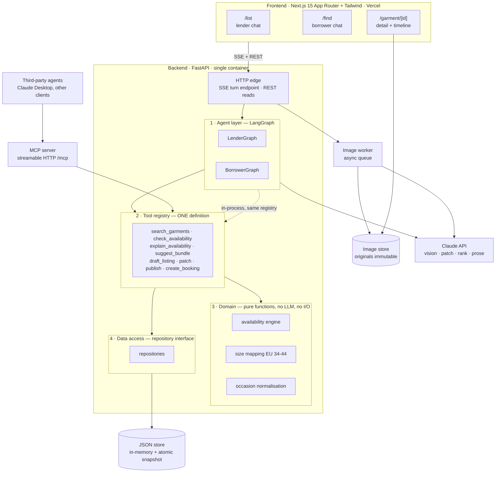
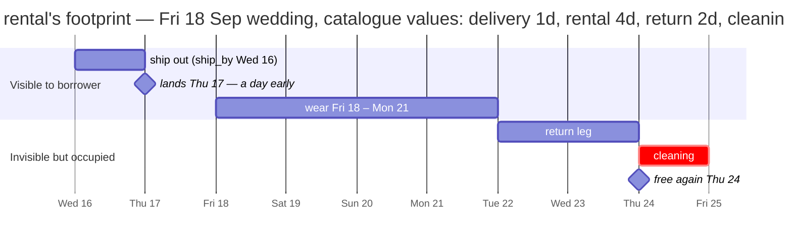
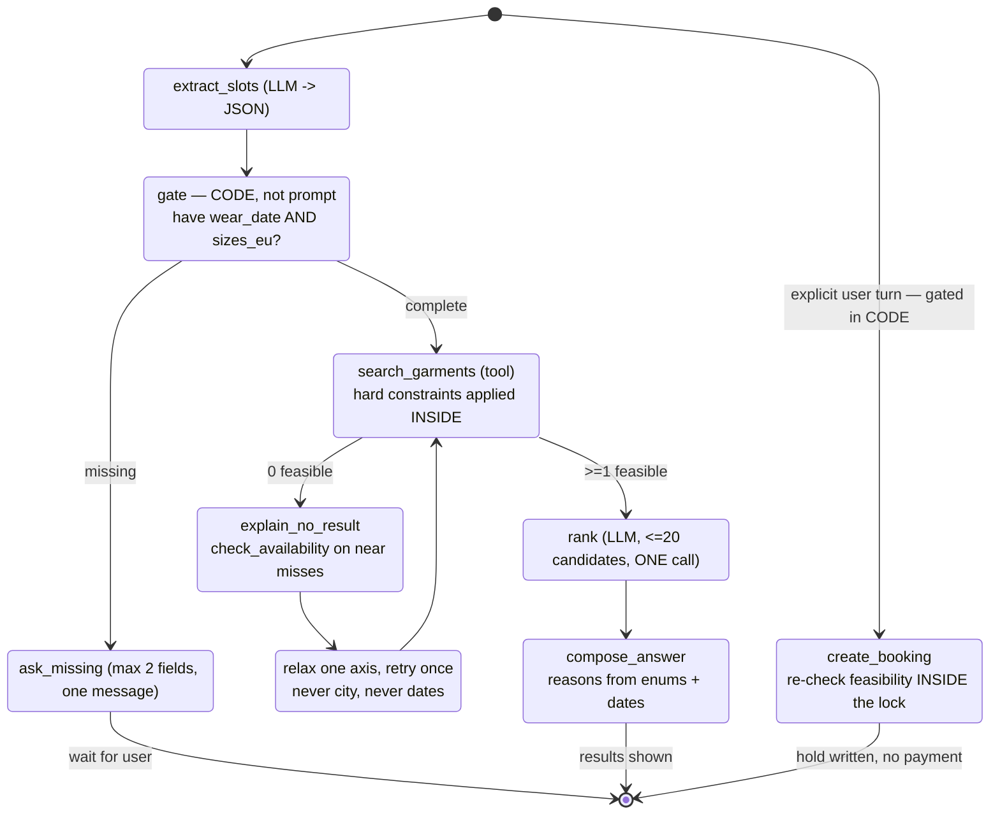
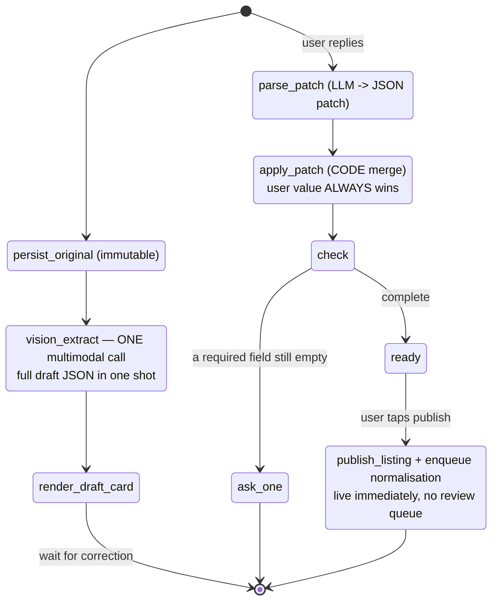
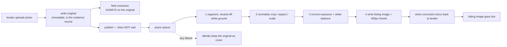
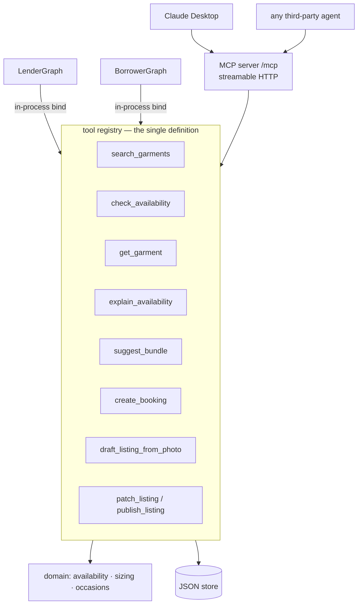

# MORE — Technical Architecture

> Implementation update (2026-09-13): `/mcp` now exposes the four existing registry tools using the official Python SDK's low-level server. This milestone is an **authless demo** as requested; the API-key scopes, write rate limits, extra tools and FastMCP approach described below remain the original target design. See [MCP setup](backend/docs/mcp-demo-zh.md) and [local verification](backend/docs/mcp-acceptance-zh.md).

**Version 0.1 · 12 September 2026 · companion to SPEC.md**

Stack per `dress-rental-prd.md` with one change: Next.js + Tailwind,
Python/FastAPI, LangGraph, and a **JSON store in place of Postgres** (§3.1).
Booking **is** built this weekend, on both sides, and takes **no payment** —
a real hold with no money attached (§3.1.2).

§3.1 is written against the draft catalogue that now exists at
`backend/data/catalog.json` (386 records). Every distribution and every count in
this document was measured from that file, not assumed.

## The two roles

Fixed vocabulary for the whole project. Use these words everywhere — prose, code,
UI copy, prompts, tool descriptions — and never the old ones.

| Term | Who | Previously |
|---|---|---|
| **borrower** | the person who rents a garment *for* an occasion — Mira | renter |
| **lender** | the person who lends her garment *out* — Lena | owner, then renter |

The pair reads correctly in plain English with no gloss, which is the point: a
borrower borrows, a lender lends, and neither word has to be explained to a judge
or printed with a definition beside it in the UI. `renter` is retired outright —
it was ambiguous in both directions and should not appear anywhere.

One carry-over: **`catalog.json` still uses `owner_id`, `owner_name`,
`owner_city` and `owner_rating`.** Those are real keys in a real file and are left
untouched in §3.1 on purpose. Map them to `lender_*` **in the loader**, in one
place, so the seed stays as it is and nothing downstream ever sees the old word.

---

## 0. The one decision everything else follows from

SPEC §1.1 makes a single load-bearing claim: *the model reads intent and
explains results; it never decides whether something is free.* An architecture
either enforces that structurally or it doesn't, and no amount of prompt
discipline substitutes.

So the system is split along that line and not along the usual ones:

| | Who does it | Property required |
|---|---|---|
| **Deterministic core** | pure Python functions, no LLM, no I/O | correct, unit-tested, reproducible |
| **Tool boundary** | one tool registry, hard constraints applied inside | *unbypassable* — callers cannot opt out |
| **Conversational shell** | LangGraph + Claude | fluent, recoverable, replaceable |

Three consequences shape the rest of this document:

1. **Availability is a pure function.** It runs without a database and without a
   model, which is why it can be trusted and demonstrated.
2. **The tool layer filters, the caller only presents.** `search_garments`
   returns *only* feasible garments. An agent — ours or a stranger's over MCP —
   is physically unable to offer a dress that cannot arrive. The product's
   central promise is enforced at a function boundary, not in a system prompt.
3. **"It asks before it searches" is an edge in a graph, not an instruction.**
   A model that forgets is a product failure; a graph that cannot take the edge
   is a guarantee.

---

## 1. System overview



Read the two dotted-vs-solid paths into the tool registry as the point of the
diagram: **our own agents and a stranger's agent enter through the same door.**

---

## 2. Frontend

Next.js 15, App Router, Tailwind. Server Components for the catalogue and detail
pages; one Client Component subtree for the conversation.

### 2.1 Routes

| Route | Rendering | Purpose |
|---|---|---|
| `/` | static | choose a side — two buttons for the demo |
| `/list` | client chat | lender listing conversation |
| `/find` | client chat | borrower conversation |
| `/garment/[id]` | server | **original photo first**, gallery, availability timeline |

### 2.2 Components

| Component | Note |
|---|---|
| `ChatStream` | consumes the typed SSE event union; the only place that talks to the stream |
| `AgentQuestion` | a question renders **visibly differently** from an answer. Asking instead of guessing is the defining behaviour (SPEC §1.2) — make the judge see it happen |
| `ListingDraftCard` | every field carries a provenance badge: `from photo` / `you said`, plus `size not verified` |
| `ResultCard` ×3 | image, lender, price, **`lands Thu 17 Sep`**, one-line reason |
| `AvailabilityTimeline` | four bars — ship · wear · return · **cleaning**. Labelled `cleaning`, never `booked` |
| `PhotoInput` | two modes: `persist` (lender) and `ephemeral` (borrower — posted inline, never written to storage) |

### 2.3 Four frontend rules

1. **The server owns slot state.** The browser holds `conversation_id` and the
   message list. Nothing else. Two state machines that must agree is the bug
   that eats Sunday morning.
2. **No date arithmetic in the frontend, not even for display.** `ship_by`,
   `lands_on` and `free_again` arrive as ISO strings. The moment the UI computes
   a date, "computed in exactly one place" stops being true — and that sentence
   is the pitch.
3. **No model calls from the browser.** Keys stay server-side, and it keeps the
   agent graph as the only orchestrator.
4. **The borrower's reference photo never reaches storage.** It is posted in the
   multipart turn, read into vocabulary, and dropped (SPEC §3.2 step 3). This is
   enforced by the endpoint, and the frontend must not helpfully cache it.

### 2.4 Contract with the backend

```
POST /api/conversations                     -> { conversation_id, role }
POST /api/conversations/{id}/turn           -> text/event-stream
                                               multipart: text + optional image
GET  /api/garments/{id}                     -> Garment
GET  /api/garments/{id}/availability?wear=…  -> Feasibility
POST /api/listings/{id}/publish             -> { garment_id }
POST /mcp                                    (MCP, streamable HTTP)
GET  /health
```

SSE events are a discriminated union — `token` · `question` · `listing_draft` ·
`results` · `availability` · `booking_claim` · `error` · `done`. Generate the
TypeScript types from the Pydantic models once; it costs twenty minutes and
removes the entire class of "the card rendered blank" bugs.

---

## 3. Backend

### 3.1 Layer 4 — data, and why it is JSON

The draft catalogue already exists at `backend/data/catalog.json` — **386 records,
about 500 KB, one flat array**. This section documents what is actually in it, not
an idealised schema.

#### The record as it stands

```jsonc
{
  "id": "item-0000",              // unique across the file, verified
  "sku": "DC123154",
  "source_url": "https://…",      // provenance — see §8.9
  "name": "Lara Black Jersey Dress",
  "name_raw": "Lara Siyah Jarse Elbise",
  "designer": "OPULENCE",
  "category": "dress",            // dress 250 · jewellery 95 · bag 41
  "silhouette": "column",         // column 195 · fitted 42 · mermaid 9 · a-line 3 · null 41
  "colour_raw": null,             // ALWAYS null — 386/386. Dead field.
  "colour_family": "black",       // null on 88 (60 jewellery, 18 dresses, 10 bags)
  "occasion": ["gala","party"],   // 6 values only — see below
  "formality": 5,                 // 4 → 201 · 5 → 177 · 2 → 6 · 3 → 2
  "style_tags": ["jersey","slit","floor-length"],   // empty on 112
  "sizes_raw": ["34","36","38","40"],
  "sizes_eu": [34,36,38,40],      // empty on exactly the 136 accessories
  "rental_price": 95,             // EUR. min 20 · median 85 · max 360
  "currency": "EUR",
  "rental_price_try": 1825,
  "retail_price": 830,            // the cover anchor (SPEC §4.4)
  "rental_days": 4,               // 4 on ALL 386 records
  "image": "/images/item-0000.jpg",
  "image_local": "/images/item-0000.jpg",   // identical to `image` on every record
  "image_url": "https://…",       // remote original, do not fetch at runtime
  "owner_id": "owner-00",         // 15 lenders, denormalised onto every item
  "owner_name": "Lena",
  "owner_city": "Hamburg",        // Hamburg 285 · Bremen 26 · Lübeck/Hannover/Kiel 25 each
  "owner_rating": 4.7,
  "booked": [{"from":"2026-09-16","to":"2026-09-21"}],  // 759 blocks, 2–6 days, Sep 15 – Nov 1
  "delivery_days": 1,             // 1 → 132 · 2 → 126 · 3 → 128
  "return_days": 2,               // 2 on ALL records
  "cleaning_days": 1,             // 1 on ALL records
  "condition": "excellent",       // excellent 257 · very good 129
  "description": "Floor-length evening gown …"
}
```

#### The real occasion vocabulary

Six lowercase values, **not** the ten `SCREAMING_SNAKE` enums in
`dress-rental-prd.md` §8. The PRD's list is obsolete; this is what the data has:

| value | count | group for relaxation |
|---|---|---|
| `gala` | 330 | formal |
| `party` | 222 | semi-formal |
| `formal` | 191 | formal |
| `engagement` | 146 | formal |
| `wedding` | 137 | formal |
| `weekend` | 26 | casual |

Normalise free text onto these six and nothing else. Five of the six sit in one
group, so occasion is a weak discriminator — §6's relaxation ladder should drop
occasion *early*, not late.

#### Computed on load, never stored in the seed

The seed is the lender's declaration; these are the engine's derived view:

| Derived | From |
|---|---|
| `is_sized` | `category == "dress"` — the 136 accessories have no `sizes_eu` and must **skip** the size filter, not fail it |
| `hold_from` / `hold_to` per booking | the `booked` block, expanded by the legs — see §8.5, this is a decision you must make explicitly |
| `available_from` / `available_to` | **absent from the data.** Default to `today … today + 120d` and drop that clause from the feasibility test, or the second condition compares against nothing |
| `lenders` index | group by `owner_id` (the seed's spelling — map to `lender_id` here) — required for `suggest_bundle` and every lender-side view. Each Hamburg lender holds ~10 accessories, so bundling is real |
| `thumb` | there is one image per record and no thumbnail. Generate at load or in the worker |

`retail_price`, `delivery_days`, `return_days` and `cleaning_days` are not
invented numbers — they are what SPEC §4 says logistics, cleaning and inspection
actually take. That is the difference between a modelled domain and made-up
figures, and it is the sentence to use if a judge pushes.

**Fields to delete or ignore:** `colour_raw` (null on all 386), `image_local`
(duplicates `image`), `rental_price_try` (not used anywhere in the flow).

This is the *shape* of the data. It is not a SQL schema.

#### 3.1.1 The store is JSON, and that is a decision rather than a shortcut

**Runtime is in-memory; JSON is the seed and snapshot format.** Not "read the
file on every query."

| | |
|---|---|
| `backend/data/catalog.json` | read-only seed, in git — 386 records, ~500 KB |
| `backend/data/state/bookings.json` | written at runtime — **new** bookings only |
| `backend/data/state/listings.json` | written at runtime — garments published during the demo |
| boot | load → Pydantic models with real `date` fields → dicts keyed by id |
| reads | list comprehensions over ≤50 objects |
| writes | mutate memory, then atomic snapshot (`tmp` + `os.replace`) |
| reset | delete `data/state/` |

Three reasons this costs the architecture nothing:

1. **The availability engine is already store-free** — no session, no clock
   except a parameter. Swapping the store touches layer 4 and nothing else.
2. **Nothing in the query path needs SQL.** A vector store was already rejected;
   a hard filter over 386 records is a list comprehension that runs in under a
   millisecond. Measured on the hero query — Hamburg, EU 38, dress, Fri 18 Sep —
   it cuts 386 to **24**, which is what makes a single re-rank call possible.
   The hard filter is not a preliminary step before the interesting part; it *is*
   what keeps the interesting part cheap.
3. **No database constraint was load-bearing.** The overlap check lives in the
   pure domain layer on purpose, so Postgres was not enforcing anything.

**Never rewrite `catalog.json` on a booking.** Runtime writes go to the small
`state/` files and are merged over the seed at load. Rewriting 500 KB on every
booking is wasted work and it widens the window in which a killed process leaves
a corrupt file — and the file it would corrupt is the entire catalogue.

One honest correction to the earlier argument for JSON: at 386 records and 500 KB,
"hand-edit the seed during rehearsal" is no longer the clean lever it would be at
15 records. **Make `today` an injectable parameter instead** — the engine already
takes no clock except a parameter, so a `--demo-date` flag shifts the whole demo
without touching data. Editing one lender's `booked` block stays easy; shifting the
demo's date does not require editing anything.

> **How to say it on stage:** "an in-memory store behind a repository interface —
> Postgres is a config swap." Not "we used a JSON file." Keep the repository
> interface identical to what a SQLAlchemy version would expose, and Postgres
> becomes a day-one task afterwards rather than a rewrite.

#### 3.1.2 The write path — booking is real, so this is the part that must be right

Booking is built on both sides this weekend. Writes therefore come from two
places — `create_booking` and `publish_listing` — and a booking must block every
other borrower **immediately** (SPEC §3.2 step 8). The first risk is no longer file
corruption; it is **time-of-check / time-of-use**.

```
WRONG   feasibility check ... then  lock → write → unlock
        two requests both pass the check, then both write. Double booking.

RIGHT   lock → re-check feasibility → commit → snapshot → unlock
        one critical section covering check AND commit.
```

Single process plus one lock around check-and-commit is *correct*. Concurrency
safety comes from the critical section, not from the storage engine — which is
exactly why JSON is not weaker than SQLite here.

Conditions, in order of how much damage they prevent:

1. **One `asyncio.Lock` wrapping feasibility re-check + commit**, shared by both
   write paths.
2. **Pin `uvicorn --workers 1`.** Two workers means two in-memory states and
   silent double bookings. One container was already the choice for SSE, so this
   costs nothing — but pin it explicitly or someone will "optimise" it on Sunday.
3. **Atomic writes** — temp file plus `os.replace()`. A truncated JSON file from
   a process killed mid-write is unrecoverable at the worst possible moment.
4. **Snapshot on every commit, not on shutdown.** If a booking is made on stage
   and the process restarts, that booking must still be there — otherwise the
   demo contradicts its own central claim.
5. **An idempotency key on `create_booking`.** A double-tap on a phone is now a
   real double-booking path.
6. **Parse dates exactly once, at boot**, into Pydantic `date` fields. JSON has
   no date type and this product is entirely date arithmetic; a `str` vs `date`
   comparison is the worst bug available here. Via Pydantic this is *safer* than
   raw driver rows.

**The one thing Postgres could do that JSON cannot** — and that is deliberately
not done this weekend — is make double booking structurally impossible:

```sql
EXCLUDE USING gist (garment_id WITH =, daterange(ship_by, free_again) WITH &&)
```

Worth knowing. It duplicates logic that lives in the domain layer by design, so
it is a belt-and-braces measure, not a reason to run Postgres for a demo.

**Payment stays out, the hold is real.** This is not a fake booking: the garment
genuinely disappears from everyone else's results. Only the money is absent, and
the UI and the MCP tool description must both say `reserved · no payment taken`.
A real hold misread as a paid rental is a trust problem, not a copy problem.

### 3.2 Layer 3 — the availability engine

Pure functions. No database session, no model, no clock injected from outside a
parameter. This is the first thing built and the only thing with real test
coverage.

```
BUFFER_DAYS = 1          # baked in, never shown to the borrower

ship_by     = wear_date − delivery_days − BUFFER_DAYS
lands_on    = ship_by + delivery_days          # ==  wear_date − 1
back_by     = return_date + return_days
free_again  = back_by + cleaning_days

hold(request)  = [ ship_by , free_again ]      # the whole footprint of a rental
hold(booking)  = [ b.ship_by , b.free_again ]

feasible  ⟺  today ≤ ship_by
          ∧  hold ⊆ [available_from, available_to]
          ∧  ∀ b ∈ bookings :  hold ∩ hold(b) = ∅
          ∧  requested_sizes ∩ sizes_eu ≠ ∅
          ∧  garment.city = request.city
```

Every infeasible answer returns a **reason enum**, never prose:

`TOO_LATE_TO_SHIP` · `OUTSIDE_LENDER_WINDOW` · `OVERLAPS_BOOKING` ·
`IN_CLEANING` · `SIZE_MISMATCH` · `WRONG_CITY`

`IN_CLEANING` is `OVERLAPS_BOOKING` where the collision falls in the cleaning
tail rather than the wear window. It is worth its own value for one reason: it
is what lets the UI say *cleaning* and the agent say *"it's back from the
wedding on Monday but not out of cleaning until Wednesday"* — the low-cost
realism point in SPEC §4.2, delivered from data.

**This enum is the whole reason SPEC §3.2 step 6 is honest.** The model receives
`{reason, ship_by, lands_on, free_again}` and writes a sentence. It is
explaining arithmetic it did not do and cannot override.



The garment is unavailable from the **16th to the 24th** for a dress worn over one
weekend. **Nine days of hold for four days of wear** — that ratio is the reason
availability is worth computing at all, and it is the single most convincing
number in the pitch.

Note the leg values come from the catalogue, and two of them are the reverse of
what an earlier draft of this document assumed: `return_days` is 2 and
`cleaning_days` is 1 on all 386 records, and `rental_days` is 4, not 3. The sum is
what the arithmetic uses, so the formula is unchanged — but any figure or UI label
naming the legs individually has to match the data.

### 3.3 Layer 2 — the tool registry

One decorator, one source of truth:

```python
@tool(name="check_availability",
      input=CheckAvailabilityIn, output=Feasibility,
      scope="read", internal=True, external=True)
def check_availability(garment_id, wear_date, return_date=None) -> Feasibility: ...
```

Two thin adapters read the same registry:

- `adapters/langgraph_tools.py` — binds in-process for our graphs, no HTTP hop
- `adapters/mcp_server.py` — a FastMCP app mounted at `/mcp`, exposing
  `external=True` tools

This is §6, and it is the decision that makes the MCP server a 45-minute task
instead of a three-hour one that gets cut.

### 3.4 Layer 1 — the agent graphs

**BorrowerGraph**



The `gate` node is the product. It is four lines of Python
(`if not (s.wear_date and s.sizes_eu)`) and it is what SPEC §1.2 sells.

**LenderGraph**



State carries `provenance: {field: "vision" | "user"}`. That map is what makes
"corrections always win" mechanical rather than a prompt hope, and it drives
both the `from photo` / `you said` badges and the `size_unverified` flag.

Graph state is JSON and is persisted to `conversations.slots`. Printable state
is worth more than any other debugging affordance on a hackathon weekend, and it
is also what `dump_agent_state` exposes.

---

## 4. Image pipeline — beside the request, never inside it



Four hard constraints, all from SPEC §4.3:

1. **Extraction runs on the original.** Colour is a filter field; any colour
   processing upstream of extraction poisons matching — the bug where the photo
   shows bright blue and the match was computed as navy.
2. **Publish never waits.** A 10–20 second upload stall kills the demo. Original
   is the cover until the normalised version replaces it.
3. **Normalise presentation, never the garment.** No colour deepening, no fabric
   smoothing, no removing a pull or a stain. Crossing that line converts a
   rental service into a misrepresentation.
4. **Corrected colour is confirmed by the lender before publish**, and condition
   is always declared in words.

One asyncio queue in the same process is enough at this scale. No Celery, no
Redis, not this weekend.

---

## 5. MCP service

Both directions, as decided: our own agents call the backend *through* MCP tool
definitions, and third-party agents get the same tools over HTTP.



### 5.1 Surface

| Tool | Scope | Returns | Internal | External |
|---|---|---|---|---|
| `search_garments` | read | **feasible garments only**, each with its Feasibility and rank score | ✓ | ✓ |
| `check_availability` | read | `{feasible, ship_by, lands_on, free_again, reason?}` | ✓ | ✓ |
| `get_garment` | read | full garment + image URLs | ✓ | ✓ |
| `explain_availability` | read | the four legs, plus every booking considered and why it did or didn't clash | ✓ | ✓ |
| `suggest_bundle` | read | same-lender accessories clearing the same deadline as **one** delivery | ✓ | ✓ |
| `create_booking` | `booking:write` | a **real hold** on the garment — **no payment taken** | ✓ | scoped |
| `draft_listing_from_photo` | write | ListingDraft | ✓ | ✗ |
| `patch_listing` / `publish_listing` | write | ListingDraft / garment_id | ✓ | ✗ |

### 5.2 Five rules that make the boundary trustworthy

1. **Hard constraints live inside `search_garments`, not in the caller.** There
   is no `include_infeasible` flag and there will never be one. A third-party
   agent cannot show a dress that misses Friday even if its own prompt tells it
   to. *This is the demo line: the promise is enforced by the API surface, not
   by our prompt discipline.*
2. **Every result carries the arithmetic.** `ship_by` and `lands_on` ride along
   on each match, so any caller's explanation is grounded in the same numbers.
3. **No tool returns prose.** Reasons are enums plus dates. Sentence-writing is
   the caller's job, which is exactly why a foreign agent's sentences are as
   truthful as ours.
4. **Reference photos never cross the boundary as a stored ref.** `style_hints`
   are already-extracted vocabulary tokens. "Used and discarded, never stored"
   survives the MCP boundary by construction.
5. **`create_booking` writes a real hold and takes no money — the description
   says both, in words.** The garment genuinely vanishes from everyone else's
   results; only payment is absent. A vague description lets a foreign agent
   imply the rental is paid for, which is a trust problem rather than a copy
   problem.

Auth: API key → scope set. Default keys are read-only; `booking:write` is issued
separately and rate-limited. Writes are idempotent on a caller-supplied key.

### 5.3 The cost of the internal path, and the fix

Binding in-process means our own traffic never exercises the MCP transport, so
a serialisation bug can hide until a judge plugs in Claude Desktop. Mitigation is
one contract test: run every `external=True` tool through the HTTP server with
the same fixtures the unit tests use. Twenty minutes, run it in CI.

### 5.4 Why this is worth demo time

Someone installs `MORE` in their own Claude and asks *"can any of these
reach me by Friday?"* — and gets an honest answer from a service they have no
prompt control over. That reframes the project from *a chat UI over a catalogue*
to *a deterministic availability service with a conversational client*, which is
a considerably harder thing to have built in a weekend.

---

## 6. Deployment

| Piece | Where | Why |
|---|---|---|
| Frontend | Vercel | what Next.js is for |
| Backend + worker | **one Fly.io / Railway container** | SSE, a 5–10s multimodal call and a background queue do not fit serverless limits — and a stream dying mid-demo is unrecoverable |
| Store | **JSON on a container volume** — `data/seed` in git, `data/state` written | no database to provision; `data/state` must sit on a **persistent volume**, or a container restart loses every booking made on stage |
| Images | container volume, `IMAGE.path` behind one interface | SPEC says local; S3 is a one-file swap later |

Secrets server-side only. One `.env`; local setup is now `uvicorn --workers 1`
plus the seed files — no `docker-compose.yml` needed at all.

---

## 7. Build order

Ordered so that the thing everything else depends on exists first.

| # | Task | Est. | Depends |
|---|---|---|---|
| 1 | **Availability engine + size mapping, pure + unit-tested** (no DB, no LLM) | 60m | — |
| 2 | Loader over `catalog.json` → Pydantic models, derived fields, and the §8.5 `booked` decision | 45m | 1 |
| 3 | Tool registry + `search_garments` / `check_availability`, curl-testable | 60m | 1, 2 |
| 4 | BorrowerGraph: extract → gate → search → rank → compose | 120m | 3 |
| 5 | Frontend borrower chat + 3 result cards + timeline | 150m | 3 |
| 6 | LenderGraph: photo → draft → one correction → publish | 90m | 3 |
| 7 | **Booking, both sides** — locked write path, code-gated booking turn, confirm step, lender sees the incoming hold and her `ship by` date | 120m | 3, 4, 5, 6 |
| 8 | **MCP HTTP server** (same registry, ~30 lines) + Claude Desktop config | 45m | 3 |
| 9 | Image normalisation worker + fallback | 60m | 6 |
| 10 | End-to-end + rehearse every fallback path, **including the two-window booking demo** | 90m | 4–9 |

**Cut order:** 9 → LenderGraph's ask-back increment → `suggest_bundle`.
**Never cut 1, 3, 4, 5, 7.**

Booking was not in the original nine tasks and it is not free — 120 minutes
across five places. That time comes out of task 9; the image pipeline falls back
to original photos, which was already the first thing on the cut list.

**The cheap win on the lender side.** SPEC §4.1: *the lender is told her ship-by
date, not asked for one.* One line on her garment card — `ship by Wed 16 Sep` —
closes the loop from borrower booking to engine arithmetic to lender action. A few
lines of code for a complete causal chain a judge can watch.

**The strongest moment in the demo.** Two browser windows side by side. Book in
one; the dress disappears from the other's results in the same second. SPEC §3.2
step 8 stops being a sentence in a document and becomes something done on stage.
It needs both windows on the same process — see §3.1.2 condition 2 — and it needs
rehearsing, because it is also the moment a double-booking bug would surface.

Note where 7 sits. MCP is cheap *because* of 3. Without a single registry it
becomes a three-hour job and gets cut — which is why the registry, not the MCP
server, is the actual architectural decision.

---

## 8. Findings — read this before wiring the loader

These came out of running the arithmetic above against the real
`backend/data/catalog.json` (386 records) and against SPEC's own scenario dates.
§8.1 and §8.5 are demo-breaking; §8.2 is now **closed by the data**.

**Hero query measured against the actual catalogue** — today Wed 16 Sep, wear
Fri 18 Sep, Hamburg, EU 38, dresses:

| Outcome | Count |
|---|---|
| `FEASIBLE` | **24** |
| `TOO_LATE_TO_SHIP` | 72 |
| `OVERLAPS_BOOKING` | 19 |
| `SIZE_MISMATCH` | 69 |
| `WRONG_CITY` | 66 |

Two things to take from that table. The demo works — there are 24 real answers.
And **the largest single refusal is delivery**: 72 garments are excluded because
they cannot physically arrive. That is the product's thesis, measured, in one
number. Put it on a slide.

### 8.1 The hero scenario fails against SPEC's own numbers · **blocking**

SPEC Scenario A has Lena declaring her gown *"booked the 20th to the 25th"*, and
Scenario B has Mira renting **that same gown** for a Friday-the-18th wedding.

The catalogue reproduces the collision, slightly differently: `item-0000` belongs
to Lena and carries `booked: [{from: 2026-09-16, to: 2026-09-21}]` — squarely
across the hero window. Run the hero query and `item-0000` returns
`OVERLAPS_BOOKING`. **The dress the demo script names as result #1 is one of the
19 the engine refuses.**

That is the engine working correctly, and 24 other dresses do come back. But the
script says *"one of them was listed by Lena an hour earlier"*, and that sentence
is currently false.

**Fix — pick one:**

1. Move `item-0000`'s block clear of the window (e.g. `2026-09-27` → `2026-10-02`),
   which makes it feasible with `lands_on` = Thu 17 Sep. Verified.
2. Or rewrite Scenario A around whichever of the 24 feasible dresses you actually
   want on screen, and give *that* one to Lena.

Option 2 is better, because it means the demo is reading the data rather than the
data being bent to the demo. Either way: **run the demo script's dates through the
engine before the rehearsal, not after.**

### 8.2 `delivery_days = 2` kills the hero query — **closed by the data**

Previously flagged as blocking. The catalogue splits `delivery_days` across 1, 2
and 3 (132 / 126 / 128), and 43 of the Hamburg EU-38 dresses ship in a single day.
So the hero query survives — and the 2s and 3s are what produce the 72
`TOO_LATE_TO_SHIP` refusals that make the point.

No change needed. Do **not** normalise `delivery_days` to a single value to "fix"
the refusals; the spread is the most valuable property in the file.

### 8.3 SPEC contradicts itself on the delivery floor

§2.4 says *"three days is the floor"*; Scenario B is two days out.

**Resolution: the engine has no floor.** It computes and answers honestly,
including "no". The three-day statement is a targeting claim about who the
product is designed around, not a constraint to implement. Implementing it as a
constraint would reject the spec's own hero query.

### 8.4 The buffer is specified twice

§4.1 says both `ship_by = wear_date − delivery_days` and "one day of buffer is
baked in". Pick one: `ship_by = wear_date − delivery_days − 1`. That is what
makes "arrives Thursday for a Friday wedding" true, and it is assumed above.

### 8.5 `booked` semantics are undefined — decide this first · **blocking**

Each record carries `"booked": [{"from": …, "to": …}]`. Nothing says whether that
range is the **wear window** the lender declared, or the **full hold** including
shipping, return and cleaning. The two readings give different answers, and not
by a rounding margin:

| Hero query, Hamburg EU 38 dresses | `booked` read raw | `booked` expanded by the legs |
|---|---|---|
| Fri 18 Sep | 24 feasible | 22 feasible |
| Fri 25 Sep | 58 feasible | **34 feasible** |
| Fri 2 Oct | 58 feasible | **38 feasible** |

**Recommendation: treat `booked` as the wear window**, and expand it on load into
`hold_from = from − delivery_days − 1` and `hold_to = to + return_days +
cleaning_days`. Reasons: block lengths run 2–6 days, which reads as wear periods
rather than footprints; an lender declaring unavailability declares the days she
needs the dress, not the days the platform needs it; and it is the conservative
reading, so the failure mode is "we showed one fewer dress" rather than
"we double-booked".

Whichever way it goes, **write the decision down in the loader**, because the same
expansion has to be applied when a new booking is written or the two will disagree.

### 8.6 Two feasibility clauses have no data behind them

- **`available_from` / `available_to` do not exist** on any record. The clause
  `hold ⊆ [available_from, available_to]` currently compares against nothing.
  Either default the window to `today … today + 120d` on load, or drop the clause
  and say so — a silent always-true condition is worse than an absent one.
- **`formality` does not discriminate.** 378 of 386 records are 4 or 5. Mira's
  *"quite formal"* removes 8 items from the catalogue. Use it for ranking, never
  for hard filtering, and do not ask the borrower for it as though it narrowed
  anything.

### 8.7 The accessories are 136 records with no size, and that is correct

`sizes_eu` is empty on exactly the 95 jewellery plus 41 bag records. The size
filter must **skip** unsized categories rather than fail them, or `suggest_bundle`
returns nothing and the clutch in SPEC §3.2 step 7 never appears.

Good news for that step: every Hamburg lender holds around 10 accessories, so
same-lender bundling has real data behind it.

### 8.8 Nulls that the filters must tolerate

`colour_family` is null on 88 records — including 18 dresses. `silhouette` is null
on 41, `style_tags` empty on 112. Treat null as **unknown, do not exclude**: a
missing colour must not remove a dress from a query that mentions a colour, it
must only lose the ranking points. Excluding on null silently shrinks the
catalogue by a quarter.

`colour_raw` is null on all 386 — delete the field rather than leaving a hook
someone later assumes is populated.

### 8.9 Image provenance — decide before the demo is public

Every record carries a `source_url` and an `image_url` pointing at a live
commercial rental site, and `rental_price_try` alongside the euro price. The
images are mirrored locally in `backend/images/`, so nothing is hot-linked at
runtime — but `dress-rental-prd.md` §14 asks for imagery that avoids copyright risk, and
third-party product photography with the original product URL attached does not
meet that on its own.

Options, in order of how little work they are: keep the data private to the demo
and say plainly on stage that the catalogue is scraped placeholder content; or
swap the dozen garments that actually appear on screen for own or
openly-licensed photographs and leave the rest as unshown filler. Either is
fine. What is not fine is a public deployment that serves them without comment.

### 8.10 Operational risks

| Risk | Mitigation |
|---|---|
| LLM re-rank latency | cap candidates at 20, one call, stream a "looking" state |
| Vision call is the slowest thing in the product (5–10s) | stream progress; never block publish on normalisation |
| Model calls `create_booking` unprompted | gate it in code on an explicit user turn — not in the prompt |
| A real hold read as a paid rental | `reserved · no payment taken` in the tool description, the payload **and** the UI |
| Double booking under concurrent borrowers | one lock around check-and-commit, `--workers 1` pinned, and the two-window case rehearsed (§3.1.2) |
| A truncated `data/state/*.json` kills the demo | atomic `tmp` + `os.replace()` on every snapshot |
| City filter vs. shipping arithmetic doing the same job | v1 is Hamburg-only: keep the city filter so Berlin stock can never be offered, and let `delivery_days` do the real work |
